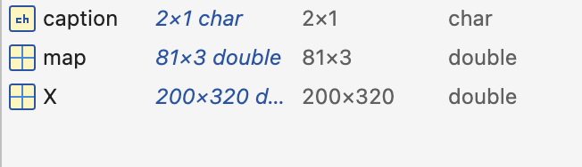
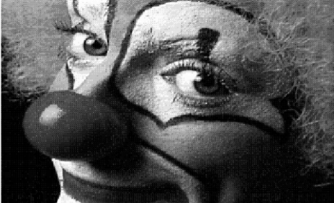

# Lab 1
### Loading and Understanding the Test Image

The provided “clown” dataset is loaded in MATLAB as an indexed colour image represented by the matrix X and the colormap map, while caption only provides descriptive metadata of the image. In the workspace, X appears as a 200 × 320 double-precision matrix whose elements store colour index values (rather than direct grayscale intensities). The variable map is an 81×3 double matrix representing the colormap.
Each row specifies an RGB colour value in the range [0,1], and the pixel values in X act as indices that reference these colours. 
display the clown image using `imshow()`

```matlab
load clown
imshow(X, map)
```

 

Although the indexed display may appear coloured depending on the MATLAB version, converting the image using `ind2gray` produces a true grayscale intensity image.

```matlab
I = ind2gray(X, map);   
imshow(I)
```


The variable `I` is a 200 x 320 two-dimensional matrix representing the grayscale intensity (brightness)of each pixel, with values in the range [0, 1]. If we type 

```matlab
value = I(20,319)  
 ``` 
Matlab responds with the greyscale value of the image at (319,20): 
```matlab
value = 0.3425
``` 
