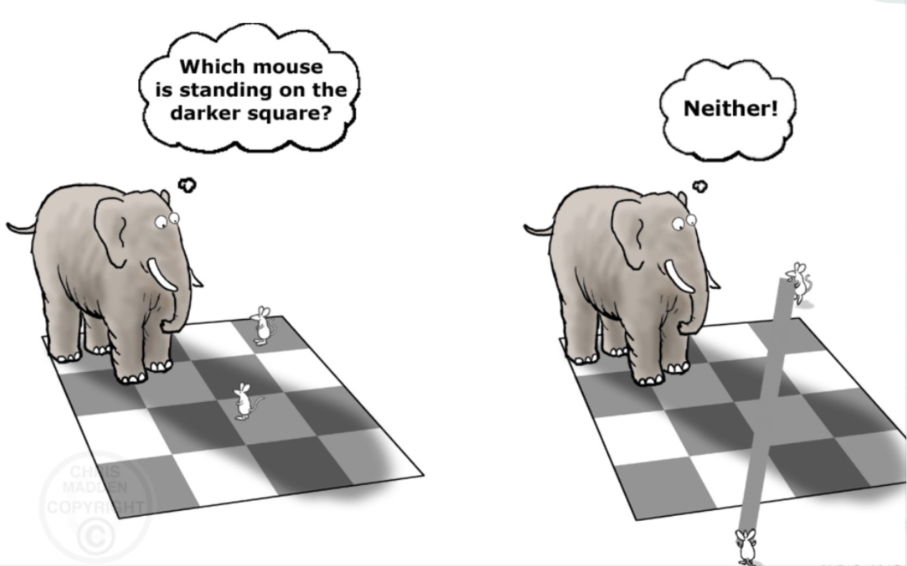

# Lab2  Colour and Perception
## Part 1 - Seeing Colours and Shapes
### Task 1 - Find your blind spot
#### 1. Biological Foundation
* The Retina: The back of the eye covered in light-receptive cells (rods and cones).
* Fovea Centralis: The central region of the retina responsible for sharp, color-sensitive vision.
* The Blind Spot (Optic Disc): The specific location where the optic nerve exits the eye to carry information to the brain.
    * This area lacks photoreceptor cells, meaning it cannot detect light.

#### 2. Experimental: How to Find Your Blind Spot
**Setup**: A screen with an "O" on the left and an "X" on the right.

**Procedure**: 
* Position your nose directly in front of the X.
* Close your right eye and stare only at the X with your left eye.
* Slowly move your head closer to or further from the screen.

**Observation**: At a specific distance, the "O" will disappear from your vision.
* because its image falls exactly on the optic disc.

#### 3. The "Filling-In" Phenomenon (Brain Interpolation)
The brain hates "holes" in our vision, so it uses interpolation (filling in the gaps) to create a seamless image.
| Visual Context | What the Brain Does | 
| :--- | :--- | 
| **Solid Background** | Fills the blind spot with the surrounding color (e.g., making it look solid red). |
| **Geometric Lines** | Completes broken lines so they appear continuous through the blind spot. |
| **Complex Textures** | Perfectly replicates textures (like zebra stripes) to hide the missing area. |

**Key Takeaway**: What we perceive as "reality" is actually a combination of raw data from our eyes and active construction/editing by our brain. We don't see the world exactly as it is; we see a "corrected" version of it.

### Task 2 - Ishihara Colour Test

**Purpose and Mechanism**
* The Ishihara test is a color perception test for red-green color deficiencies.
* It specifically targets deficiencies in the **long-wavelength (L) cones** and **medium-wavelength (M) cones**.
* The test consists of a series of **pseudo-isochromatic plates**, which contain a circle of dots appearing randomized in color and size.

**Biological Goal**
* The test evaluates the ability to distinguish a figure (usually a number) from the background based solely on color contrast.
* Within the pattern, dots of specific hues form a number that is visible to those with normal color vision but difficult or impossible to see for those with color blindness.

**Key Metrics**
| Test Element | Targeted Deficiency | Clinical Significance |
| :--- | :--- | :--- |
| **L-cones** | Protanopia / Protanomaly | Difficulty perceiving red light. |
| **M-cones** | Deuteranopia / Deuteranomaly | Difficulty perceiving green light. |

### Task 3 - Reverse Colour

**Experimental Observation**
* **Stimulus**: Staring at a distorted American flag (e.g., cyan, black, and yellow) for an extended period.
* **Response**: Shifting gaze to a neutral white surface reveals the flag in its correct colors (red, white, and blue).

**Scientific Explanation**
1. **Photoreceptor Fatigue**: 
* When you stare at a specific color, the cone cells in your retina that are sensitive to that color become "fatigued" or overstimulated.
* This leads to a temporary decrease in their sensitivity.

2. **Opponent Process Theory**:
* Our visual system processes colors in antagonistic pairs: Red vs. Green, Blue vs. Yellow, and Black vs. White.
* While the receptors for the "funny" colors are inhibited/fatigued, the receptors for their opposing colors remain fresh and fully sensitive.

3. **Resulting Perception**:
* When looking at a white sheet (which reflects all wavelengths), the fatigued receptors fail to respond fully, while the fresh "opponent" receptors fire strongly.
* As a result, your brain perceives the complementary colors:
   * Green (distorted) → Red (afterimage)
   * Yellow (distorted) → Blue (afterimage)

**Conclusion**: Afterimages demonstrate that color perception is a dynamic process involving the balancing of opposing neural signals.

### Task 4 - Troxler's Fading 

**Experimental Observations**
* **Lilac Chaser Test**: Staring at the central black cross causes the rotating gap to appear as a green moving spot. Eventually, the surrounding magenta spots disappear entirely, leaving only a grey background.
* **Fading Experiment**: Staring at a central red dot causes the surrounding fuzzy blue/grey ring to gradually fade and blend into the white background.

**Scientific Explanation**
1. **Neural Adaptation (The Core Reason)**:
* Our sensory system is designed to detect changes rather than constants. 
* When a stimulus in the peripheral vision remains unchanging (stationary and blurred), the neurons responsible for perceiving it stop firing after a few seconds.
* This is a "filtering" mechanism that prevents the brain from being overwhelmed by non-essential, constant information.

2. **The "Green" Spot (Afterimage Connection)**:
* Similar to Task 3, as the magenta/lilac spots fatigue the receptors, the brain perceives the opponent color (Green) in the empty space where the spot just was.

3. **Relationship to the Visual System**:
* Troxler’s fading highlights that our brain constantly "ignores" stable images on our retina (like the shadows of blood vessels inside the eye). 
* Small, involuntary eye movements (microsaccades) usually prevent this fading in daily life by shifting the image slightly across different photoreceptors.

**Conclusion**: Troxler's fading proves that perception is heavily dependent on change. If a visual signal is constant and lacks sharp edges, the brain eventually "deletes" it from our conscious awareness.

### Task 5 - Brain sees what it expects (Visual Illusions)

**Experiment 1: Shepard Tables (Size Perception)**

**Observation**: The blue table appears to be long and thin, while the red table appears to be shorter and more square. However, measuring them reveals the tabletops are identical in size and shape.

**Scientific Explanation**:
* Perspective Cues: Our brain interprets the 2D image as 3D objects. 
* The vertical orientation of the blue table suggests depth, making the brain "compensate" by perceiving it as longer. 
* This is known as Size Constancy —the brain adjusts the perceived size based on the perceived distance and angle.

**Experiment 2: Checker Shadow Illusion (Brightness Perception)**

**Observation**: Square A looks significantly darker than Square B. In reality, both squares are the exact same shade of grey.

**Scientific Explanation**:
* Shadow Compensation: The brain identifies that Square B is in the shadow of the green cylinder.
* Local Contrast vs. Global Expectation: 
  * The brain knows that Square B is part of a "white" checkerboard pattern.
  * It automatically "filters out" the shadow to determine what the actual surface color *should* be.
  * Consequently, the brain perceives B as lighter than it actually is to compensate for the darkness of the shadow.

**Conclusion**: These tasks demonstrate that the brain is not a passive receiver of light; it is an active interpreter. It prioritizes "making sense" of the world (depth, shadow, object constancy) over literal accuracy.

### Task 6 - The Grid Illusion

**Experimental Observations**
* **Scintillating Grid**: When staring at the center of the grid, dark dots appear to flash or "scintillate" rapidly at the white intersections in the peripheral vision. These dots disappear when looking directly at a specific intersection.
* **Hermann Grid**: Similar "ghostlike" grey blobs appear at the intersections of a white grid on a black background.

**Scientific Explanation**
1. **Lateral Inhibition Theory**:
* Visual intensity is determined by a group of receptors responding to a receptive field. 
* A retinal ganglion cell excites when center receptors detect light, but is inhibited by receptors in the surrounding area.
* Intersections are surrounded by more light-colored areas than the middle of a line; therefore, they experience increased inhibition, making them appear darker to the brain.

2. **Scintillating vs. Hermann Grid**：
* The scintillating grid illusion involves higher-level cortical processing and perceptual grouping in addition to local lateral inhibition mechanisms.
* The strength of the effect increases with the number of grid intersections rather than requiring a fixed minimum grid size.  

**Alternative Theories**
* Some studies attribute the illusion to the responses of V1 simple cells combined with microsaccadic eye movements, rather than solely to retinal lateral inhibition.

**Conclusion**: The Grid Illusion demonstrates that our perception of brightness is not absolute. It requires strong, high-contrast signals to trigger competitive neural processing (lateral inhibition), which the brain uses to enhance edge detection and contrast.

### Task 7 - Cafe Wall Illusion
The Cafe Wall illusion (also known as the Münsterberg illusion or kindergarten illusion) was first described by Hugo Münsterberg in 1894 and later named after a cafe wall in Bristol in 1973.

**Experimental Observation**
* **The Illusion**: In the image of staggered rows with alternating black and white rectangles, the straight horizontal dividing lines appear to be sloped or wedge-shaped, even though they are perfectly parallel.
* **The Role of Contrast**: This phenomenon is not observed when the black and white are replaced by different colors of the same brightness or lower contrast (e.g., the pink and cyan checkerboard).

**Scientific Explanation**
1. **Irradiation and Spatial Filtering**:
* Early accounts linked the illusion to the irradiation effect, where bright regions appear larger than dark regions.
* However, contemporary research suggests the illusion is more accurately explained by interactions between luminance contrast, spatial filtering, and orientation-selective mechanisms** in early visual cortex.

 
2. **Contrast Polarities**: 
* Contrast polarities between the "bricks" (the colored rectangles) and the "mortar" (the dividing lines) appear to be the determining factor in the direction of the perceived tilt.

3. **Neural Components**: 
* While components of the illusion remain even when optical and retinal factors are removed, it is heavily dependent on the high-contrast interaction between different color levels.
  
**Conclusion**: our brain uses contrast and brightness boundaries to define geometric relationships. When contrast is high, "errors" like the irradiation illusion can distort our perception of parallel lines, but these errors disappear in low-contrast environments.

### Task 8 - The Silhouette Illusion (Spinning Dancer) 

**Experimental Observation**
**The Phenomenon**: When watching the silhouette of a pirouetting female dancer, observers initially perceive her spinning in one direction (e.g., clockwise). 

**Perceptual Shift**: After continued observation, the dancer may suddenly appear to spin in the opposite direction (counterclockwise), even though the stimulus remains unchanged.

**Scientific Explanation**
1. **Bistable Perception**: 
* This is a kinetic, bistable optical illusion where the image is visually ambiguous. 
* Because the image is a 2D silhouette, there are no depth cues (such as shadows on the body or surface details) to indicate whether her arms are passing in front of or behind her body. 
* As a result, the brain can validly reconstruct the 3D motion in two different ways.

2. **Psychological Biases**:
* **Viewing-from-above Bias**: Many observers initially report clockwise rotation, although perceived direction varies across individuals and stimulus conditions. This bias is attributed to the camera elevation, which is slightly above the horizontal plane, leading the brain to assume a viewpoint from above the dancer. 

* **Brain Activation**: fMRI studies suggest that spontaneous perceptual switching in bistable motion is associated with activity across parietal and frontal attentional networks.

3. **The "Right-Left Brain" Myth**:
* In popular psychology, this illusion was incorrectly identified as a personality test to reveal hemisphere dominance. 
* Scientific research has debunked this, confirming the effect is due to visual ambiguity and spontaneous brain fluctuations rather than personality traits.
   

**How to Trigger a Change in Direction**
* **Averted Vision**: Look away slightly and use your peripheral vision to focus on the shadow or the spinning foot, then slowly move your eyes back.
* **Mental Reframing**: Try to mentally visualize her outstretched arm passing *behind* her body instead of in front.
* **Blinking**: Closing your eyes and envisioning the opposite direction before reopening them can help "reset" the brain's interpretation.

**Conclusion**: The Spinning Dancer proves that when visual data is ambiguous and lacks depth cues, our brain makes assumptions based on established biases (like viewpoint elevation). Perception is not just a reflection of the image, but an active choice made by the visual cortex.

### Task 9 – The Incomplete Triangles

**Experimental Observation**

**The Phenomenon**:  When viewing the image, many observers perceive a bright illusory triangle that appears to occlude the fragmented circular and angular elements.  

**The Reality**: In reality, there are zero complete triangles physically present. The image consists only of three “Pac-Man”-like shapes and three V-shaped line segments.  

**Scientific Explanation**
1. **Gestalt Principle of Closure**: The visual system has a natural tendency to organize incomplete elements into coherent wholes.  
It perceptually “fills in” missing boundaries between disconnected components to form a familiar geometric structure.  

2. **Subjective (Illusory) Contours**: The brain generates illusory contours—perceived edges that are not physically present on the retina.  Neurophysiological evidence shows that neurons in intermediate visual areas (e.g., V2) respond to these inferred boundaries, indicating that contour perception is actively constructed rather than directly sensed.  

3. **Brightness Perception**: The central illusory triangle often appears brighter than the uniform background, despite identical physical luminance. This reflects contextual brightness processing and surface completion within mid-level vision.  

**Conclusions**

1. **Perception as Construction**: This illusion demonstrates that visual perception is not a passive recording of sensory input but an active process that organizes fragmented information into coherent forms.  

2. **Mid-level and Top-down Influences**: Gestalt completion and neural responses to illusory contours provide the primary mechanism for the perceived triangle, while prior knowledge can further bias interpretation.  

