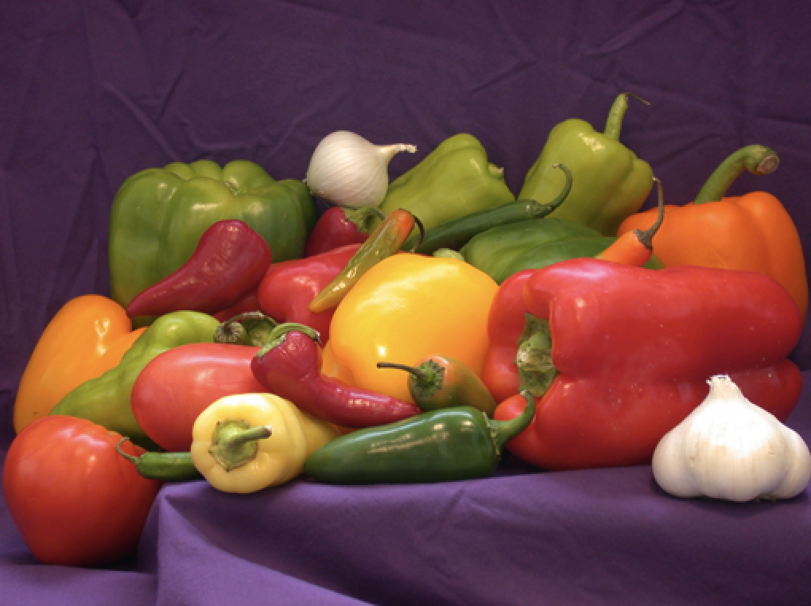
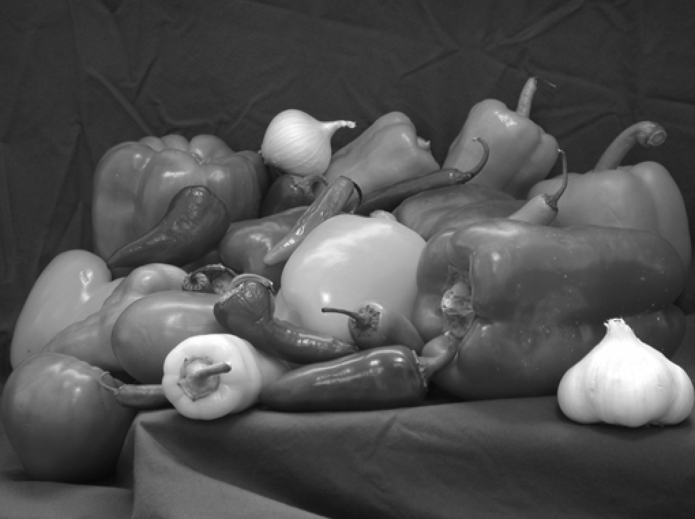
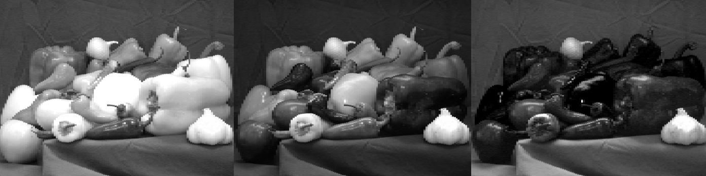

# Lab2  Colour and Perception
## Part 2 - Exploring Colours in Matlab
### Task 10 - Convert RGB image to Grayscale

First, we find out information about this photo file and read the image data into the array RGB and display it. 

```matlab
imfinfo('peppers.png')
RGB = imread('peppers.png');
imshow(RGB)
```

 

**Explanation**: The RGB image is represented as a three-dimensional matrix of size M-by-N-by-3. The third dimension corresponds to the red, green, and blue color channels. Each pixel’s final color is determined by the intensity values across these three channels.


We can converts RGB values to grayscale values by using the function `rgb2gray()`, whic forming a weighted sum of the R, G, and B components according to the equation `I = 0.299 * R + 0.587 * G + 0.114 * B`

```matlab
I = rgb2gray(RGB);
figure
imshow(I)
```
 

**Explanation**: The grayscale image I is represented as a two-dimensional M-by-N matrix. Instead of storing three color channels, the RGB values are converted into a single luminance value using a weighted combination of red, green, and blue intensities. This representation reduces data dimensionality and improves computational efficiency for image processing tasks.


We can display them side-by-side with `imshowpair( )` and add a title, so that it would be easier to compare two photo.
```matlab
imshowpair(RGB, I, 'montage')
title('Original colour image (left) grayscale image (right)');
```
`montage` is a visualization parameter that displays the two images side-by-side in the same figure window.

**Principle of Grayscale Conversion**

Grayscale conversion is not a simple averaging of Red, Green, and Blue channels. Instead, it is a weighted sum based on human visual perception.
* **The Formula: $I = 0.299R + 0.587G + 0.114B$**
* **Key Reason**: This formula accounts for the fact that the human eye has different sensitivities to different wavelengths. Specifically, the human eye is most sensitive to Green (hence the highest weight of 0.587) and least sensitive to Blue (the lowest weight of 0.114). By using these specific weights, the resulting grayscale image better preserves the perceived brightness (luminance) of the original color scene.


### Task 11 - Splitting an RGB image into separate channels

In this task, we split the RGB image into its red, green, and blue channels using the function `imsplit()`, and then display the three channel images side-by-side as a montage.

```matlab
[R, G, B] = imsplit(RGB);
montage({R, G, B}, 'Size', [1 3])
```

 

**Workspace Variable Analysis (Dimensions & Data Type)**

RGB: 384 × 512 × 3, uint8
* A 3D array representing the full colour image: height 384 (rows), width 512 (columns), and 3 colour channels.

R, G, B: each 384 × 512, uint8
* Each channel is extracted as a 2D intensity matrix (single channel).
* Spatial resolution stays the same (384 × 512), but the third dimension is removed because each output stores only one channel.

I: 384 × 512, uint8
* A 2D grayscale (intensity) image.
* Same spatial size as the original image, but only a single luminance/intensity value per pixel.

**Key observation (dimensionality reduction)**: RGB (384×512×3) → R/G/B (384×512)
* This demonstrates that splitting channels preserves the image resolution, while reducing data dimensionality from 3 channels → 1 channel per output.


**Visual Observation (Channel behaviour)**
The montage shows three grayscale-looking images corresponding to the R, G, and B channel intensities:
* Objects that are red (e.g., red peppers) appear brightest in the R channel.
* Yellow/green peppers show relatively stronger signals in R and G.
* White objects (e.g., garlic) appear bright in all three channels, because white reflects strongly across red, green, and blue wavelengths.


