# Lab3 - Intensity Transformation and Spatial Filtering

### Task 1 - Contrast enhancement with function imadjust
#### 1. Image Import and Initial Inspection
First we import the image and read the image data. 
```matlab
clear all
imfinfo('assets/breastXray.tif')
f = imread('assets/breastXray.tif');
imshow(f)
```
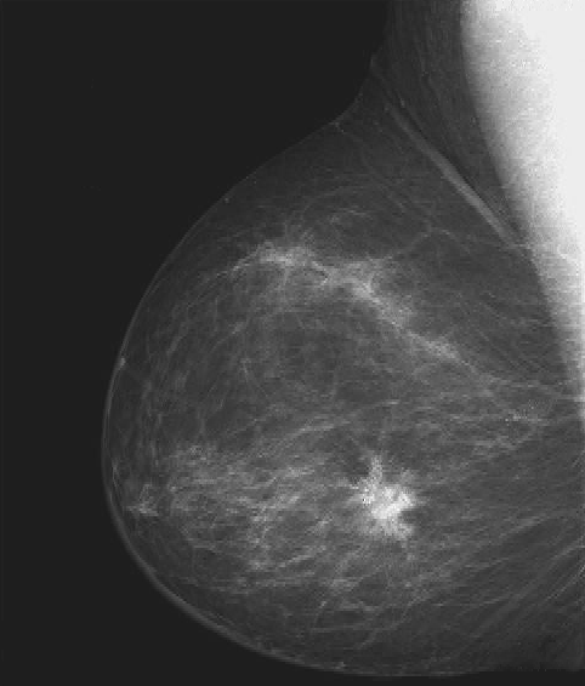 
From the MATLAB workspace, we can see that the image matrix f has a dimension of 571 × 482, representing a grayscale image with 571 rows (height) and 482 columns (width). Since the data type is uint8, pixel intensities are stored as 8-bit integer values in the range 0–255.


To understand how image data is indexed and accessed: The command f(3,10) was used to read the intensity of a single pixel.
```matlab
f(3,10)  
```

The returned value was 28. This means the pixel intensity is 28 and confirms that MATLAB stores grayscale values as integer intensities.

#### 2. Intensity Range Analysis
To determine if the image uses the full dynamic range, we calculated the minimum and maximum intensity values.
```matlab
[fmin, fmax] = bounds(f(:))
```
**Results**: While the maximum value reaches the limit of 255, the minimum value starts at 21. The image does not utilize the full range $[0, 255]$, particularly in the darker (lower) intensities, which may result in a lack of shadow detail.


#### 3. Spatial slicing
To further examine MATLAB’s matrix-based spatial indexing, spatial slicing was applied.  
The command below extracts the top half of the image by selecting the first 241 rows and all columns:

```matlab
imshow(f(1:241,:))
```
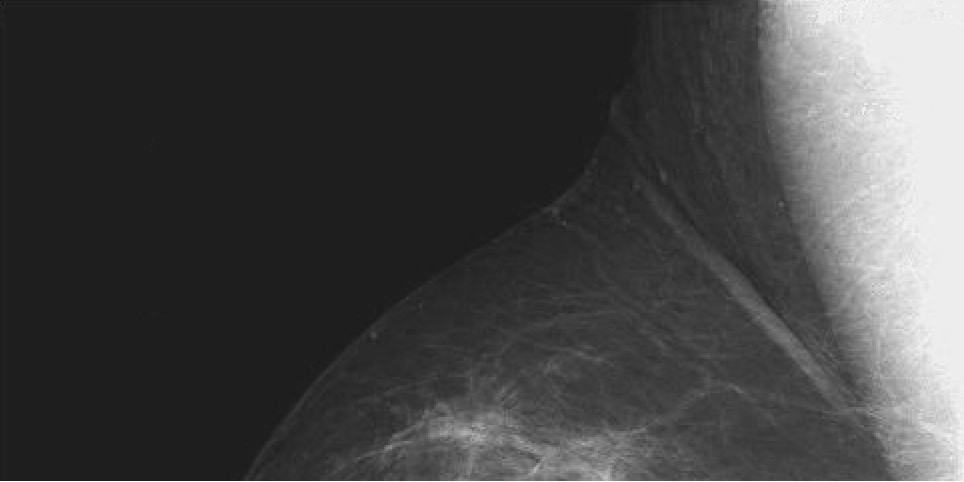 

Similarly, the right half of the image was extracted by selecting all rows and only the columns in the second half of the matrix:
```matlab
[rows, cols] = size(f);
rightHalf = f(:, floor(cols/2)+1:end);
imshow(rightHalf)
```
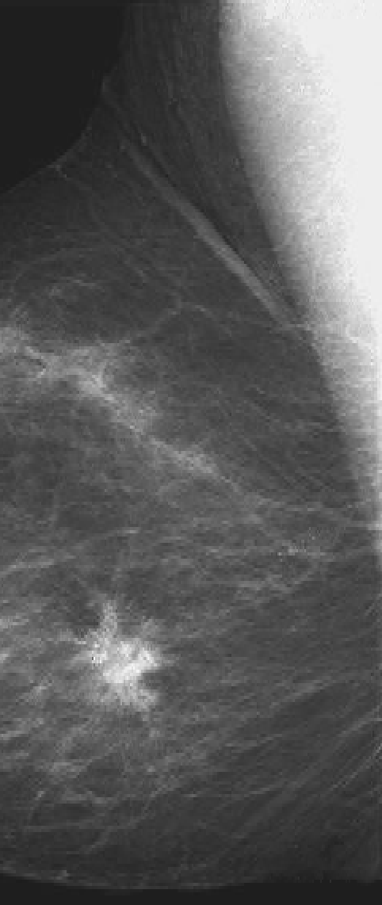 

These operations demonstrate MATLAB’s row–column indexing mechanism, where slicing rows reveals horizontal spatial regions, while slicing columns reveals vertical spatial regions of the image.

#### 4. Negative image
we compute the negative image and display both the original and the negative image side-by-side
```matlab
g1 = imadjust(f, [0 1], [1 0])
figure              % open a new figure window
montage({f, g1})
```
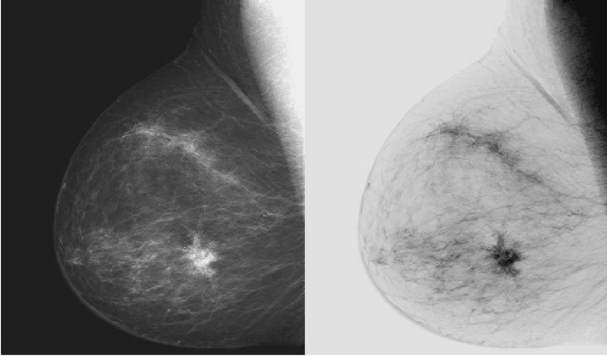 

**Explanation**: The MATLAB function imadjust was used to invert the grayscale intensity values of the input image f:
* Input range [0 1] keeps the full original intensity range.
* Output range [1 0] reverses the mapping, meaning:
  * Dark pixels become bright
  * Bright pixels become dark
This produces the negative image.

**Results**
* The output image g1 has the same size as the original image f (571×482, uint8).
* Pixel intensities are inverted across the full grayscale range.
* Visual comparison confirms correct negative transformation.

#### 5.Gamma correction
```matlab
g2 = imadjust(f, [0.5 0.75], [0 1]);
g3 = imadjust(f, [ ], [ ], 2);
figure
montage({g2,g3})
```
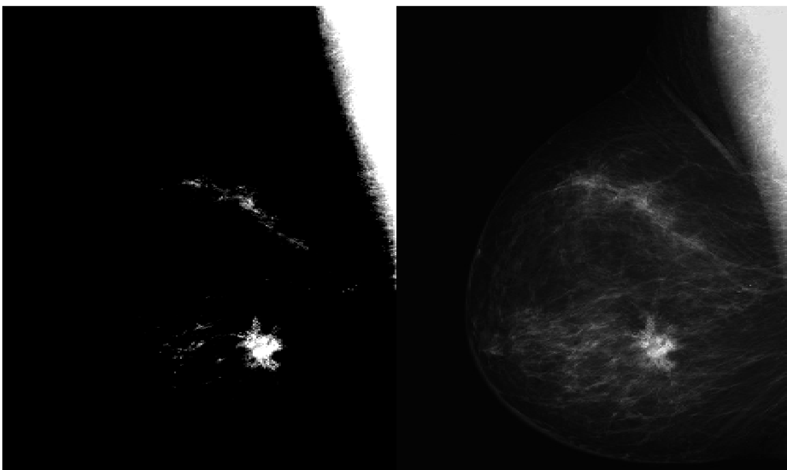 

**Explanations**
Two transformations were performed using the MATLAB function imadjust:

(1) Contrast stretching within a selected range: `g2 = imadjust(f, [0.5 0.75], [0 1])`
* The input gray-level range 0.5–0.75 is mapped to the full output range [0,1].
* Intensities below 0.5 become black, and above 0.75 become white.
* This enhances contrast in the mid-intensity region of the image.

(2) Gamma correction: `g3 = imadjust(f, [], [], 2)`
* Empty brackets [] indicate the default range [0,1].
* Gamma value γ = 2 applies a nonlinear power-law transformation: $s = c r^{\gamma}$
* Because γ > 1, darker intensities are compressed and brighter intensities are emphasised.

**Results**
* Both g2 and g3 preserve the original image size (571 × 482, uint8).
* g2 strongly enhances structures within the selected mid-gray range but loses detail outside that interval.
* g3 produces a smoother global contrast change, retaining more anatomical detail across the full grayscale range.

**Interpretation**
This experiment demonstrates the difference between:
* Linear contrast stretching (g2) – selective enhancement but possible information loss.
* Nonlinear gamma correction (g3) – perceptually balanced enhancement that preserves more structural detail.
Gamma correction is therefore more suitable for medical image visualisation, where maintaining subtle tissue information is essential.

### Task 2 – Contrast-stretching transformation

#### 1. Aim
Instead of using the built-in `imadjust` function, we apply the contrast-stretching transformation to enhance the contrast of an X-ray image and compare the result with the original.

#### 2. Transformation function
The contrast-stretching function is defined as:

$$
s = T(r) = \frac{1}{1 + \left(\frac{k}{r}\right)^E}
$$

where $r$ is the input intensity, $s$ is the output intensity, $k$ is often set to the mean intensity of the image, and $E$ controls the steepness of the mapping. A small constant `eps` is added to avoid division by zero.

#### 3. Implementation in MATLAB
* Key processing steps:
 * Convert the image from uint8 to double to allow floating-point computation.
 * Compute the mean intensity $k$.
 * Apply the nonlinear contrast-stretching transformation element-wise.
 * Normalize the result to [0,1], then rescale back to [0,255] and convert to uint8.
 * Display original and processed images side-by-side.
```matlab
clear all       % clear all variables
close all       % close all figure windows
f = imread('assets/bonescan-front.tif');
r = double(f);  % uint8 to double conversion
k = mean2(r);   % find mean intensity of image
E = 0.9;
s = 1 ./ (1.0 + (k ./ (r + eps)) .^ E);
g = uint8(255*s);
imshowpair(f, g, "montage")
```
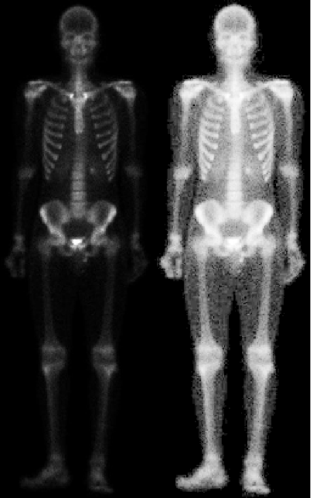 

#### 4.Results
* The processed image g preserves the same spatial resolution as the original image f (1641 × 513, uint8).
* The nonlinear transformation increases brightness and contrast in regions around the mean intensity level.
* Bone structures and anatomical details become more visible compared with the original low-contrast scan.

#### 5. Interpretation
* Unlike linear contrast stretching, this sigmoid-shaped nonlinear transformation:
* Enhances contrast near the average intensity region
* Compresses very dark and very bright regions
* Produces a perceptually clearer medical image
* Therefore, this transformation is particularly suitable for medical X-ray visualisation, where subtle structural differences must be emphasised without amplifying noise excessively.

### Task 3 – Contrast Enhancement using Histogram
#### PLotting the histogram of an image

#### 1. Aim
In this task, we analyse the grayscale intensity distribution of an image using its histogram and improve the image contrast through intensity stretching. The enhanced result is then compared with the original image.


#### 2. Plotting the histogram of the original image

MATLAB provides the function `imhist` to compute and visualise the histogram of an image.

```matlab
clear all       % clear all variable in workspace
close all       % close all figure windows
f=imread('assets/pollen.tif');
imshow(f)
figure          % open a new figure window
imhist(f);      % calculate and plot the histogram
```


 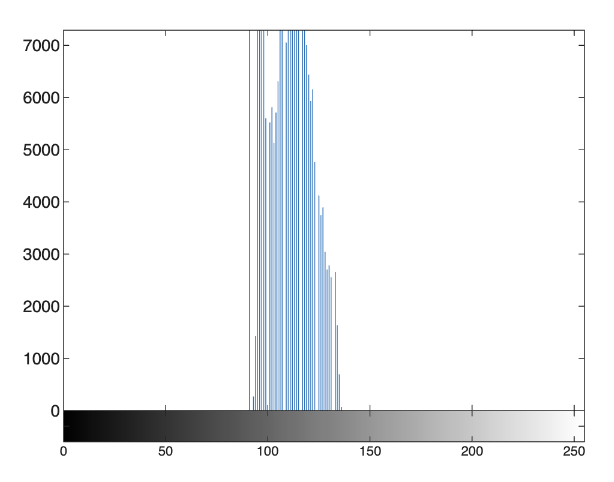 

From the histogram, the pixel intensities are mainly concentrated between 70 and 140 within the full grayscale range [0, 255], indicating that the image has low contrast and does not utilise the full dynamic range.

#### 3. Contrast stretching using imadjust
To improve contrast, the intensity range [0.3, 0.55] of the full scale is stretched to the full grayscale range.

```matlab
close all
g=imadjust(f,[0.3 0.55]);
montage({f, g})     % display list of images side-by-side
figure
imhist(g);
```
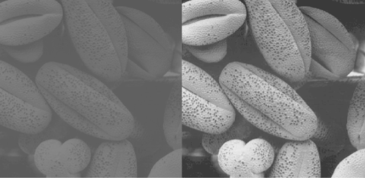 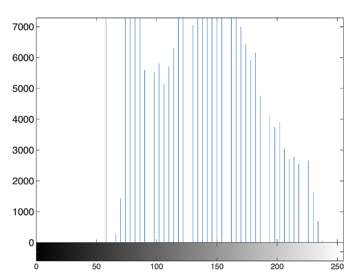 

#### 4. Results

* The processed image g preserves the same spatial resolution as the original image f (500 × 500, uint8).
* The histogram of the enhanced image is more spread across the grayscale range, indicating improved utilisation of intensity levels.
* Structural details in the pollen grains become clearer and more distinguishable compared with the original low-contrast image.

#### 5. Interpretation
Histogram-based contrast stretching effectively redistributes pixel intensities:
* Expands the mid-intensity range where most information is located
* Increases global contrast and visual clarity
* Improves perceptual visibility of fine structures

Although the enhancement improves image quality, the histogram is still not perfectly uniform, meaning further techniques (e.g., histogram equalisation) could provide additional improvement.

Therefore, histogram-guided contrast stretching provides a simple yet effective method for contrast enhancement in grayscale imaging.

#### Histogram, PDF and CDF

To further analyse the intensity distribution of the enhanced image **g**, the  **probability distribution function (PDF)** and **cumulative distribution function (CDF)**  were computed.

The PDF is a **normalised histogram**, while the CDF is the **cumulative sum of the PDF**, representing the cumulative probability of intensity values.

```matlab
g_pdf = imhist(g) ./ numel(g);  % compute PDF
g_cdf = cumsum(g_pdf);          % compute CDF
close all                       % close all figure windows
imshow(g);
subplot(1,2,1)                  % plot 1 in a 1x2 subplot
plot(g_pdf)
subplot(1,2,2)                  % plot 2 in a 1x2 subplot
plot(g_cdf)
```
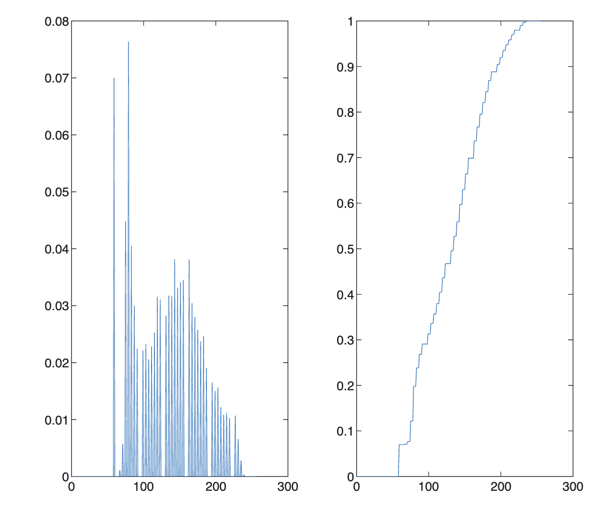 

#### Results
* Both PDF and CDF are vectors of size 256 × 1 (double), corresponding to the 256 grayscale intensity levels.
* The PDF shows that pixel intensities are mainly distributed in the mid-to-high intensity range, consistent with the contrast stretching applied earlier.
* The CDF increases smoothly from 0 to 1, confirming correct normalisation and cumulative probability behaviour.

#### Interpretation

The PDF and CDF provide complementary insights into image intensity distribution:
* PDF reveals how frequently each gray level occurs.
* CDF describes the cumulative proportion of pixels up to a given intensity.

After contrast stretching:
* The PDF becomes more spread out, indicating improved utilisation of the grayscale range.
* The CDF exhibits a steeper middle region, reflecting enhanced contrast in the dominant intensity interval.

These observations confirm that the histogram-based contrast enhancement successfully improves the perceptual quality of the grayscale image.

#### Histogram Equalization
Then we perform **histogram equalization** using the **cumulative distribution function (CDF)** as the intensity transformation  
function, and to compare the equalized image with the original and contrast-stretched images.

To visualise the mapping used in histogram equalization, the CDF of the contrast-stretched image **g** was replotted with proper axis scaling and labels.

```matlab
x = linspace(0, 1, 256);    % x has 256 values equally spaced
                            %  .... between 0 and 1
figure
plot(x, g_cdf)
axis([0 1 0 1])             % graph x and y range is 0 to 1
set(gca, 'xtick', 0:0.2:1)  % x tick marks are in steps of 0.2
set(gca, 'ytick', 0:0.2:1)
xlabel('Input intensity values', 'fontsize', 9)
ylabel('Output intensity values', 'fontsize', 9)
title('Transformation function', 'fontsize', 12)
```
 

The transformation function is monotonically increasing from 0 to 1, confirming a valid gray-level mapping suitable for histogram equalization.

Histogram equalization was applied using MATLAB’s built-in function `histeq`.

```matlab
h = histeq(g,256);              % histogram equalize g
close all
montage({f, g, h})
figure;
subplot(1,3,1); imhist(f);
subplot(1,3,2); imhist(g);
subplot(1,3,3); imhist(h);
```
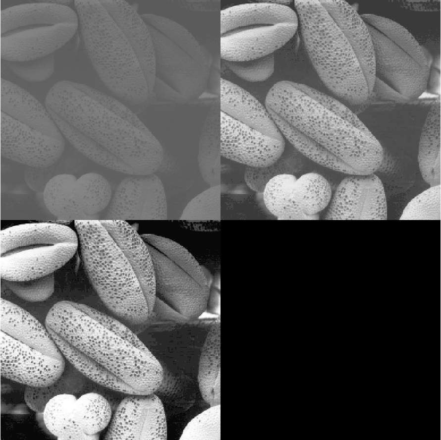 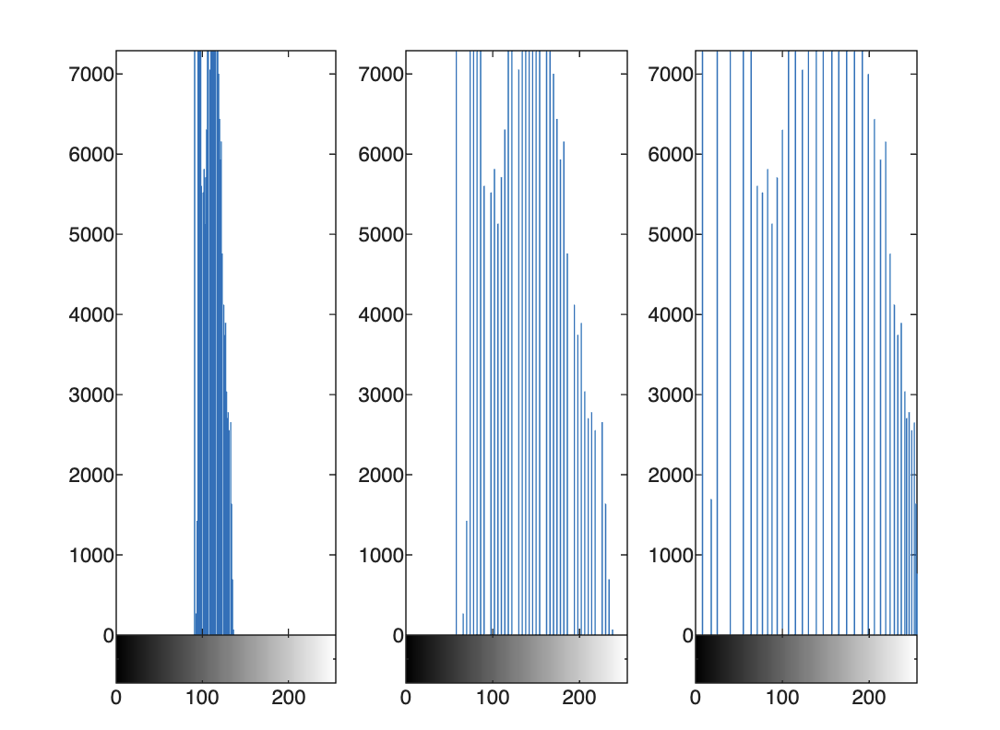 

From the MATLAB workspace: f, g, h all have size 500 × 500 (uint8); The transformation vector x has size 1 × 256 (double)
This confirms that histogram equalization preserves the spatial resolution and data type of the image.

#### Results
* The equalized image h exhibits higher global contrast than both the original image f and the contrast-stretched image g.
* Fine texture details in the seeds become more clearly visible.
* The histogram of h is more evenly distributed across the full grayscale range[0,255],indicating improved gray-level utilisation.

#### Interpretation
Histogram equalization redistributes pixel intensities according to the cumulative distribution function, producing:
* Expanded contrast in previously crowded intensity regions
* Reduced dominance of mid-range gray levels
* A more perceptually balanced grayscale image

Compared with simple contrast stretching, histogram equalization provides a stronger global enhancement, although it may also amplify noise in some regions.

Overall, histogram equalization significantly improves the visual quality and gray-level distribution of the image.


### Task 4 – Noise reduction with lowpass filter
In this task, we investigate the effect of two spatial smoothing filters — the moving average (box) filter and the Gaussian filter — on a noisy X-ray image of a printed circuit board (PCB). The objective is to reduce visible noise while preserving meaningful structural details.

The PCB X-ray image was imported and displayed.

```matlab
clear all
close all
f = imread('assets/noisyPCB.jpg');
imshow(f)
```
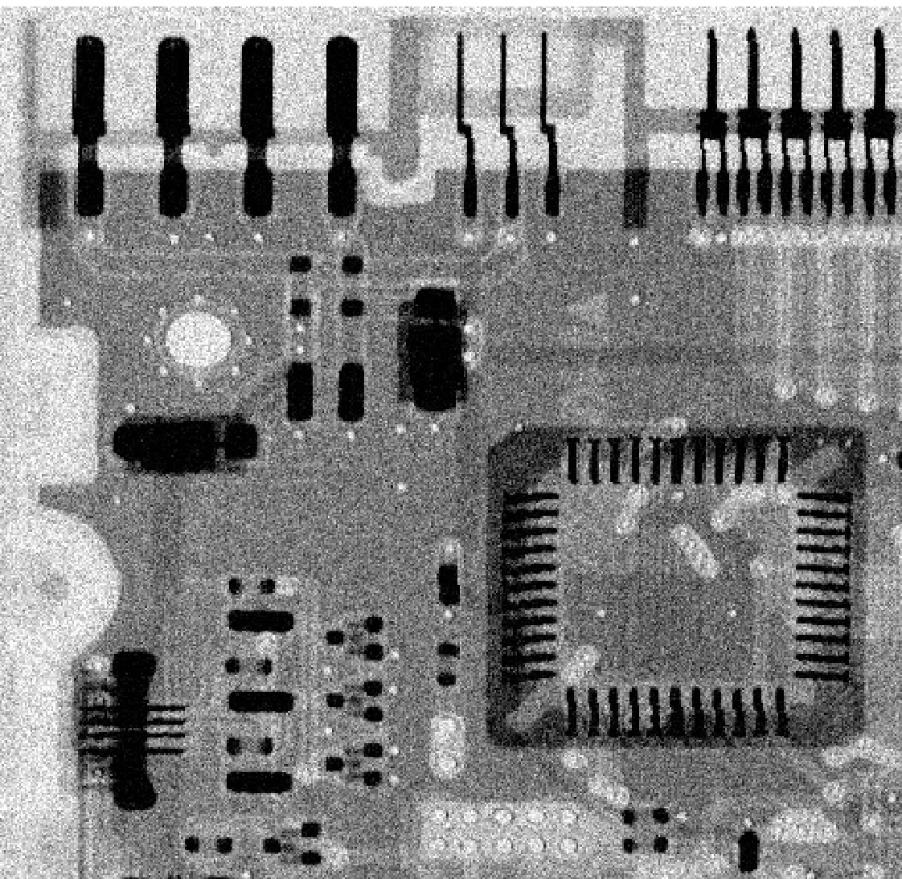 

#### Create smoothing filter kernels
Two different kernels were generated using fspecial:
* 9×9 averaging (box) filter
* 7×7 Gaussian filter with σ = 1.0

Both kernels are normalised so that their coefficients sum to 1.
```matlab
w_box = fspecial('average', [9 9])
w_gauss = fspecial('Gaussian', [7 7], 1.0)
```

#### Apply filters to the image
Each kernel was applied using spatial convolution (`imfilter`), and the results were displayed side-by-side with the original image.
```matlab
g_box = imfilter(f, w_box, 0);
g_gauss = imfilter(f, w_gauss, 0);
figure
montage({f, g_box, g_gauss})
```
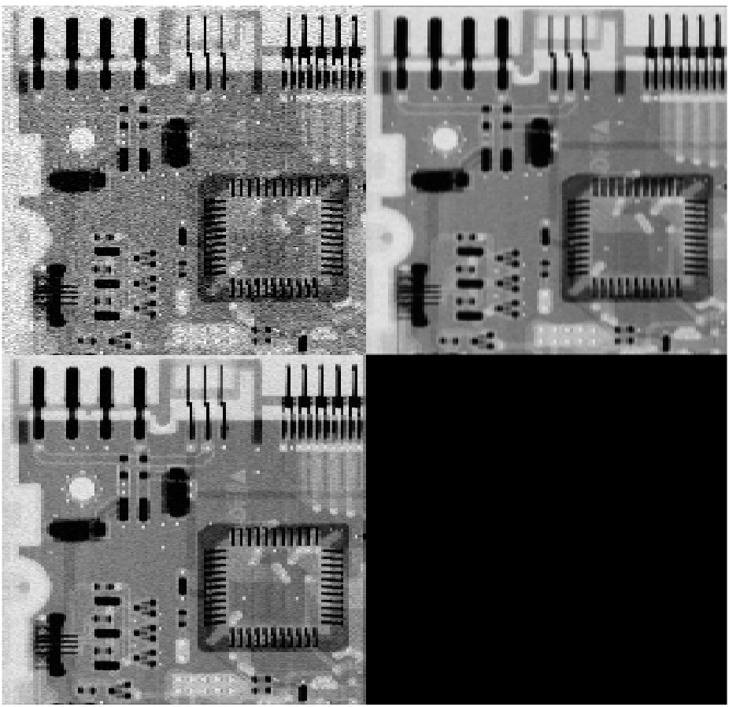 

#### Results and Observations
Noise reduction
* Both filters reduce high-frequency noise present in the original X-ray image.
* The box filter produces noticeable smoothing but also causes:
  * loss of sharp edges
  * blocky or blurred appearance

* The Gaussian filter provides:
  * smoother and more natural noise reduction
  * better preservation of edges and fine PCB structures

This occurs because Gaussian weighting gives higher importance to central pixels and less to distant pixels, unlike uniform averaging.

#### Visual comparison conclusion
* Original image: strong granular noise.
* Box filter: noise reduced but edges blurred.
* Gaussian filter: best trade-off between smoothing and detail preservation.

Therefore, the Gaussian filter is more suitable for denoising while maintaining structural information.


