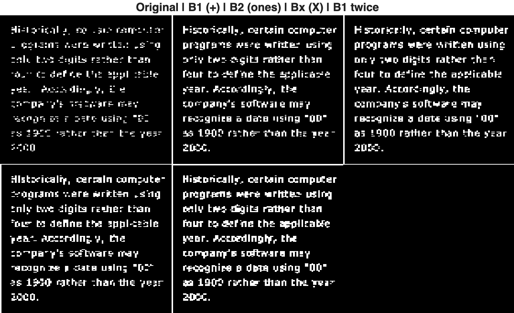
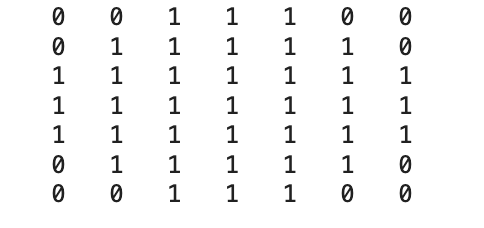

# Lab 4 - Morphological Image Processing

### Task 1: Dilation and Erosion
#### 1. Dilation Operation
First, we explore morphological dilation and understand how different structuring elements (SEs) modify visual information


#### Method
The binary image text-broken.tif was loaded into MATLAB. Morphological dilation was applied using three different 3×3 structuring elements:
* B1 (cross-shaped SE) – expands pixels in horizontal and vertical directions
* B2 (all ones SE) – expands pixels uniformly in all directions
* Bx (diagonal cross SE) – expands pixels mainly along diagonal directions

In addition, dilation using B1 was applied twice to observe the cumulative effect of repeated dilation. The code used is shown below: 
```matlab
A = imread('assets/text-broken.tif');

% SE 1: cross (+)
B1 = [0 1 0;
      1 1 1;
      0 1 0]; % create structuring element
A1 = imdilate(A, B1);

% SE 2: all ones (3x3)
B2 = ones(3,3); 
A2 = imdilate(A, B2);

% SE 3: diagonal cross (X)
Bx = [1 0 1;
      0 1 0;
      1 0 1];
A3 = imdilate(A, Bx);

% Dilate twice using B1
A1_twice = imdilate(A1, B1);

% Show results
montage({A, A1, A2, A3, A1_twice})
title('Original | B1 (+) | B2 (ones) | Bx (X) | B1 twice')
```

 


#### Results and Observations
B1 – Cross-shaped dilation
* Text strokes become thicker mainly in horizontal and vertical directions.
* Some small gaps in broken characters are partially connected.
* Character shapes remain relatively recognisable.

B2 – Full 3×3 dilation
* Produces the strongest expansion in all directions.
* Most gaps are closed and strokes become significantly thicker.
* However, nearby characters begin to merge and fine details are lost.

Bx – Diagonal dilation
* Thickening occurs primarily along diagonal directions.
* Diagonal gaps are better connected than horizontal/vertical ones.
* Overall repair effect is weaker than B2.

Repeated dilation with B1
* Applying dilation twice further enlarges foreground regions.
* More gaps close and characters become heavily thickened.
* Excessive dilation reduces readability and merges neighbouring structures.

Conclusion: Morphological dilation enlarges foreground structures according to the shape of the structuring element. Different SE geometries control direction, strength, and connectivity of expansion:
* Cross SE preserves structure best
* Full SE maximises repair but loses detail
* Diagonal SE emphasises directional growth
* Repeated dilation increases connectivity but may degrade visual clarity.

#### 2. Generation of structuring element
Structuring elements for morphological operations were generated using the MATLAB function `strel`. For example, a disk-shaped structuring element with radius 4 was created and its neighbourhood matrix was inspected to understand its binary structure.
```matlab
SE = strel('disk',4);
SE.Neighborhood         % print the SE neighborhood contents
```
 
The disk structuring element generated by `strel`('disk',4) produced a 7×7 logical neighbourhood matrix, where values of 1 represent pixels inside the disk-shaped region and 0 represent pixels outside. This confirms the discrete circular shape used for subsequent morphological operations.


