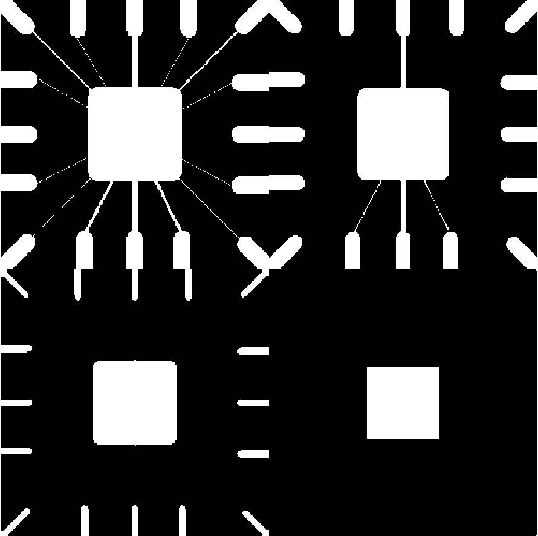
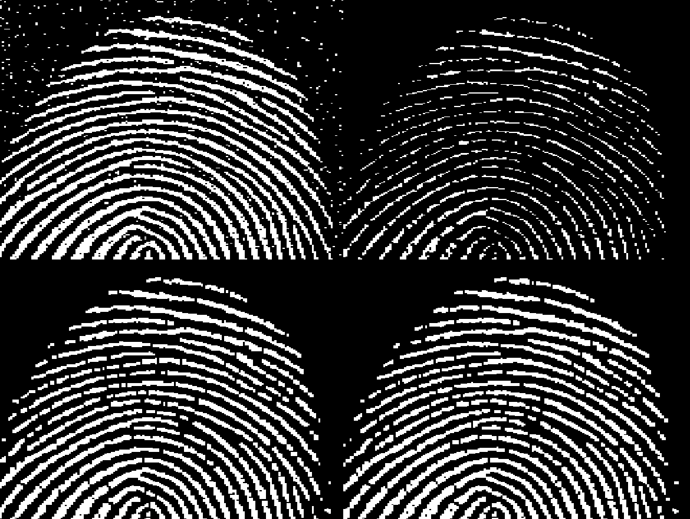
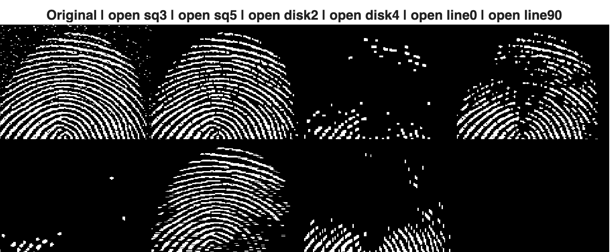
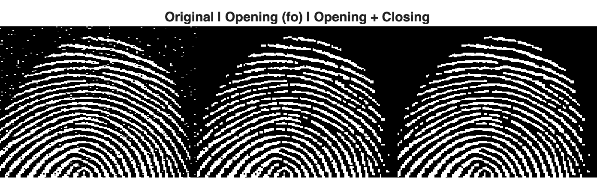
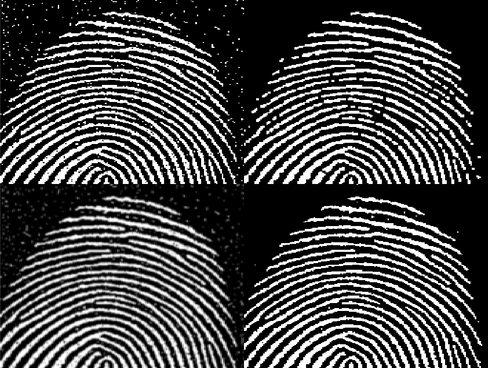
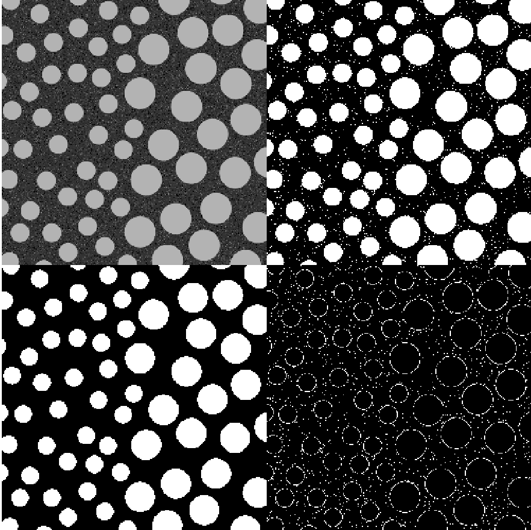

# Lab 4 - Morphological Image Processing

### Task 1: Dilation and Erosion
#### 1. Dilation Operation
First, we explore morphological dilation and understand how different structuring elements (SEs) modify visual information


#### Method
The binary image text-broken.tif was loaded into MATLAB. Morphological dilation was applied using three different 3×3 structuring elements:
* B1 (cross-shaped SE) – expands pixels in horizontal and vertical directions
* B2 (all ones SE) – expands pixels uniformly in all directions
* Bx (diagonal cross SE) – expands pixels mainly along diagonal directions

In addition, dilation using B1 was applied twice to observe the cumulative effect of repeated dilation. The code used is shown below: 
```matlab
A = imread('assets/text-broken.tif');

% SE 1: cross (+)
B1 = [0 1 0;
      1 1 1;
      0 1 0]; % create structuring element
A1 = imdilate(A, B1);

% SE 2: all ones (3x3)
B2 = ones(3,3); 
A2 = imdilate(A, B2);

% SE 3: diagonal cross (X)
Bx = [1 0 1;
      0 1 0;
      1 0 1];
A3 = imdilate(A, Bx);

% Dilate twice using B1
A1_twice = imdilate(A1, B1);

% Show results
montage({A, A1, A2, A3, A1_twice})
title('Original | B1 (+) | B2 (ones) | Bx (X) | B1 twice')
```

 


#### Results and Observations
B1 – Cross-shaped dilation
* Text strokes become thicker mainly in horizontal and vertical directions.
* Some small gaps in broken characters are partially connected.
* Character shapes remain relatively recognisable.

B2 – Full 3×3 dilation
* Produces the strongest expansion in all directions.
* Most gaps are closed and strokes become significantly thicker.
* However, nearby characters begin to merge and fine details are lost.

Bx – Diagonal dilation
* Thickening occurs primarily along diagonal directions.
* Diagonal gaps are better connected than horizontal/vertical ones.
* Overall repair effect is weaker than B2.

Repeated dilation with B1
* Applying dilation twice further enlarges foreground regions.
* More gaps close and characters become heavily thickened.
* Excessive dilation reduces readability and merges neighbouring structures.

Conclusion: Morphological dilation enlarges foreground structures according to the shape of the structuring element. Different SE geometries control direction, strength, and connectivity of expansion:
* Cross SE preserves structure best
* Full SE maximises repair but loses detail
* Diagonal SE emphasises directional growth
* Repeated dilation increases connectivity but may degrade visual clarity.

#### 2. Generation of structuring element
Structuring elements for morphological operations were generated using the MATLAB function `strel`. For example, a disk-shaped structuring element with radius 4 was created and its neighbourhood matrix was inspected to understand its binary structure.
```matlab
SE = strel('disk',4);
SE.Neighborhood         % print the SE neighborhood contents
```
 
The disk structuring element generated by `strel`('disk',4) produced a 7×7 logical neighbourhood matrix, where values of 1 represent pixels inside the disk-shaped region and 0 represent pixels outside. This confirms the discrete circular shape used for subsequent morphological operations.


#### 3. Erosion Operation
Then we explore erosion with different structuring element sizes. 
Binary image `wirebond-mask.tif` was eroded using disk-shaped structuring elements with radii 2, 10, and 20. The results were displayed using a montage for comparison.
```matlab
clear all
close all
A = imread('assets/wirebond-mask.tif');
SE2 = strel('disk',2);
SE10 = strel('disk',10);
SE20 = strel('disk',20);
E2 = imerode(A,SE2);
E10 = imerode(A,SE10);
E20 = imerode(A,SE20);
montage({A, E2, E10, E20}, "size", [2 2])
```
 

#### Results and Observations
Radius = 2 (E2)
* Thin connections become slightly narrower.
* Large square regions remain mostly unchanged.

  → Indicates weak erosion.

Radius = 10 (E10)
* Many thin wires disappear.
* Only thicker structures remain.

  → Demonstrates moderate erosion and removal of small features.

Radius = 20 (E20)
* Nearly all thin structures are removed.
* Only the largest square regions persist.

   → Shows strong erosion and clear size-based filtering effect.

Conclusion: Morphological erosion removes foreground pixels that cannot fully contain the structuring element. As the structuring element size increases:
* Small and thin structures disappear first
* Only large regions remain
* The operation behaves as a size filter on the binary image


### Task 2 - Morphological Filtering with Open and Close
#### 1. Opening = Erosion + Dilation
we explore the effect of using Open and Close on a binary noisy fingerprint image in this task. 
The noisy fingerprint image was processed using erosion, dilation, and opening with a 3×3 structuring element to produce fe, fed, and fo, which were then displayed together with the original image for comparison. The following code achieve: 
1. Read the image file 'finger-noisy.tif' into f.
2. Generate a 3x3 structuring element SE.
3. Erode f to produce fe.
4. Dilate fe to produce fed.
5. Open f to produce fo.
6. Show f, fe, fed and fo as a 4 image montage.

```matlab
clear all
close all
% 1. Read the noisy finger image
f = imread('assets/fingerprint-noisy.tif');
% 2. Generate a 3×3 structuring element
SE = strel('square', 3);
% 3. Erode f → fe
fe = imerode(f, SE);
% 4. Dilate fe → fed
fed = imdilate(fe, SE);
% 5. Open f directly → fo
fo = imopen(f, SE);
% 6. Display results as a 4-image montage
montage({f, fe, fed, fo}, 'Size', [2 2])
title('f | fe (erosion) | fed (erosion+dilation) | fo (opening)')
```
 

**Comment on the results**
* f (original image): The fingerprint ridges appear as white foreground structures, but the background contains noticeable salt-like noise, and small discontinuities are present along the ridges.

* fe (erosion): Foreground regions become thinner and many isolated white noise pixels are removed, but the fingerprint ridges are also weakened and may break into thinner segments.

* fed (erosion followed by dilation): Most of the removed white noise does not reappear, while ridge thickness is partially restored.
However, the result appears smoother than the original image, with some loss of fine detail.

* fo (opening): The result is visually very similar to fed, confirming that opening equals erosion followed by dilation.
Overall, small white noise is effectively removed, but some fine ridge details are sacrificed.

#### 2. Explore other size/shape of SE
```matlab
f = imread('assets/fingerprint-noisy.tif');

% Different structuring elements
SE_sq3  = strel('square', 3);
SE_sq5  = strel('square', 5);
SE_disk2 = strel('disk', 2);
SE_disk4 = strel('disk', 4);
SE_line7 = strel('line', 7, 0);     % horizontal line
SE_line7v = strel('line', 7, 90);   % vertical line

fo_sq3   = imopen(f, SE_sq3);
fo_sq5   = imopen(f, SE_sq5);
fo_disk2 = imopen(f, SE_disk2);
fo_disk4 = imopen(f, SE_disk4);
fo_lineH = imopen(f, SE_line7);
fo_lineV = imopen(f, SE_line7v);

montage({f, fo_sq3, fo_sq5, fo_disk2, fo_disk4, fo_lineH, fo_lineV}, 'Size', [2 4])
title('Original | open sq3 | open sq5 | open disk2 | open disk4 | open line0 | open line90')
```
 

**Comment on the results**

Changing the size and shape of the structuring element significantly affects the filtering behaviour.
* Larger structuring elements remove more noise but also cause stronger loss of fine ridge details and may break thin structures.
* Smaller structuring elements better preserve ridge continuity but provide weaker noise suppression.
* Disk-shaped elements tend to produce more isotropic and smooth results.
* Line-shaped elements introduce directional sensitivity and may preferentially affect structures aligned with the line orientation.
This demonstrates that morphological filtering is strongly dependent on the geometric properties of the structuring element.


#### 3. Improve the image fo with a close operation
```matlab
SE = strel('square', 3);  

fo = imopen(f, SE);        
fo_close = imclose(fo, SE); % improve fo using closing

montage({f, fo, fo_close}, 'Size', [1 3])
title('Original | Opening (fo) | Opening + Closing')
```
 

**Comment on the results**

Applying a closing operation after opening helps reconnect small gaps and fill minor dark discontinuities along the fingerprint ridges.
Compared with opening alone, the combined opening-then-closing result shows:
* improved ridge continuity,
* reduced small breaks or holes,
* slightly thicker ridge structures.
However, if the structuring element is too large, neighbouring ridges may merge and fine structural details can be lost.

#### 4. Compare Open+Close vs Gaussian spatial filter
```matlab
SE = strel('square', 3);

% Morphological filtering: Open + Close
f_oc = imclose(imopen(f, SE), SE);

% Gaussian spatial filter (needs grayscale -> threshold)
fg = im2double(f);
fg_blur = imgaussfilt(fg, 1.0);         % sigma=1.0
fg_bin = fg_blur > 0.5;                  % threshold 

montage({f, f_oc, fg_blur, fg_bin}, 'Size', [2 2])
title('Original | Open+Close | Gaussian blurred | Gaussian + threshold')
```
 

**Comment on the results**

Morphological filtering and Gaussian spatial filtering operate on fundamentally different principles.
* Open + Close (morphological filtering) performs shape- and size-based processing that preserves sharp binary boundaries and effectively removes small isolated noise while maintaining ridge structure.
* Gaussian filtering performs intensity averaging, which reduces noise but introduces boundary blurring and contrast loss.
After thresholding, the result can become sensitive to parameter selection and may produce broken or merged ridges.

Therefore, morphological filtering is generally more suitable for binary structural cleanup and connectivity restoration, whereas Gaussian filtering is better suited for grayscale noise smoothing but may degrade fine edge structures in binary fingerprint images.

### Task 3 - Boundary detection
The aim of this task is to extract the boundaries of blobs from a noisy grayscale image using morphological boundary detection.

The grayscale image was first inverted and binarised using Otsu’s thresholding. Morphological boundary detection was then performed by subtracting the eroded binary image from the original binary image using a 3×3 structuring element. The original image, binary image, eroded image, and detected boundary image were displayed for comparison.

```matlab
clear all
close all
I = imread('assets/blobs.tif');
I = imcomplement(I);
level = graythresh(I);
BW = imbinarize(I, level);

% Morphological boundary operator:

SE = ones(3,3);                   % 3x3 SE of 1s (as required)
BW_eroded = imerode(BW, SE);      
boundary = BW & ~BW_eroded;       


montage({I, BW, BW_eroded, boundary}, 'Size', [2 2])
title('I (inverted) | BW | eroded BW | boundary (BW - eroded BW)')
```
 

**Comment on the results**

The binarisation step produces a reasonable separation between blobs (foreground) and background; however, the noisy background introduces small spurious white regions in the binary image. After erosion, each blob shrinks slightly, and subtracting the eroded image from the original binary image leaves a thin outline corresponding to the blob boundaries. Most large blobs have clear boundaries, but some boundaries appear fragmented or contain extra edge pixels due to noise and imperfect thresholding.

**How to improve the result**
The boundary result can be improved by reducing noise before boundary extraction. For example:
* Apply morphological opening to remove small isolated foreground noise in BW before erosion/subtraction.
* Alternatively, use opening + closing to both suppress small noise and fill small gaps in blobs.
* Adjust the structuring element shape/size (e.g., a small disk) to obtain smoother, more consistent boundaries.


